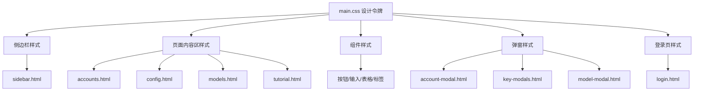

# 设计文档：前端视觉重设计

## 概述

对 CodeFreeMax 管理面板进行全面视觉重设计，从当前的深色毛玻璃风格（dark glass-morphism）转变为现代简洁的深色主题风格。新设计采用更柔和的配色、更清晰的层次结构和更精致的组件样式，同时严格保持所有现有功能和技术架构不变。

设计原则：
- **层次清晰**：通过背景色层级区分内容层次，减少对 backdrop-filter 的依赖
- **色彩克制**：使用更柔和的强调色，避免过度饱和
- **一致性**：所有组件遵循统一的设计令牌系统
- **无破坏性**：仅修改 CSS 和 HTML 模板的视觉属性，不触碰 JS 逻辑和 Go 模板语法

## 架构

### 修改范围

本次重设计涉及以下文件的修改：

```
web/
├── static/
│   ├── login.html             # 登录页面视觉更新
│   └── css/main.css           # 主样式表完全重写
└── templates/
    ├── pages/
    │   ├── accounts.html      # 账号页面布局微调
    │   ├── config.html        # 配置页面布局微调
    │   ├── models.html        # 模型页面布局微调
    │   └── tutorial.html      # 教程页面布局微调
    ├── partials/sidebar.html  # 侧边栏视觉更新
    └── components/modals/     # 弹窗视觉更新（3个文件）
```

### 不修改的文件

- `web/static/js/*.js` — 所有 JavaScript 文件保持不变
- `web/embed.go` — 嵌入式文件系统配置不变
- `internal/template/*.go` — Go 模板引擎不变

### 架构约束



## 组件与接口

### 1. 设计令牌系统（CSS 变量）

新的设计令牌系统替换当前的 `:root` 变量定义：

```css
:root {
  /* 主色调 - 从 Indigo 转为 Blue-Violet */
  --primary: #7c5cfc;
  --primary-hover: #6a4de8;
  --primary-light: rgba(124, 92, 252, 0.12);
  --primary-glow: rgba(124, 92, 252, 0.3);

  /* 强调色 - 更柔和的色调 */
  --accent-purple: #a78bfa;
  --accent-pink: #f472b6;
  --accent-cyan: #22d3ee;
  --accent-blue: #60a5fa;
  --accent-green: #34d399;
  --accent-orange: #fbbf24;
  --accent-red: #f87171;

  /* 背景色 - 更温暖的深色调 */
  --bg-body: #0c0e1a;
  --bg-surface: rgba(22, 27, 45, 0.85);
  --bg-surface-hover: rgba(35, 42, 65, 0.7);
  --bg-elevated: rgba(30, 36, 58, 0.9);
  --bg-sidebar: rgba(14, 17, 30, 0.95);

  /* 文字色 */
  --text-main: #eef0f6;
  --text-secondary: #8b92a8;
  --text-muted: #5a6178;

  /* 边框色 */
  --border-color: rgba(139, 146, 168, 0.1);
  --border-highlight: rgba(139, 146, 168, 0.2);

  /* 阴影 */
  --shadow-sm: 0 2px 8px rgba(0, 0, 0, 0.15);
  --shadow-md: 0 8px 24px rgba(0, 0, 0, 0.2);
  --shadow-lg: 0 16px 48px rgba(0, 0, 0, 0.3);
  --shadow-glow: 0 0 24px rgba(124, 92, 252, 0.12);

  /* 间距 */
  --space-xs: 4px;
  --space-sm: 8px;
  --space-md: 16px;
  --space-lg: 24px;
  --space-xl: 32px;
  --space-2xl: 48px;

  /* 圆角 */
  --radius-sm: 6px;
  --radius-md: 10px;
  --radius-lg: 14px;
  --radius-xl: 20px;

  /* 过渡 */
  --transition-fast: all 0.15s ease;
  --transition: all 0.2s cubic-bezier(0.4, 0, 0.2, 1);
  --transition-slow: all 0.3s cubic-bezier(0.4, 0, 0.2, 1);
}
```

### 2. 侧边栏组件

新的侧边栏设计：
- 背景：纯深色，不使用 backdrop-filter
- Logo 区域：新的渐变色和形状
- 菜单项：左侧圆角高亮条 + 背景色变化
- 统计底栏：更紧凑的布局，使用新的分隔线样式
- 退出按钮：更明显的悬停效果

HTML 结构保持不变，仅通过 CSS 更新视觉效果。所有 `onclick` 事件和 Go 模板变量（`{{.ActiveTab}}`、`{{.Stats.*}}`）保持不变。

### 3. 统计卡片组件

新的 Stat_Card 设计：
- 移除 `::before` 伪元素的顶部高亮线
- 图标区域使用更大的圆角和更柔和的背景色
- 悬停效果：微妙的上移 + 边框色变化（保留当前的 translateY 效果）
- 数值字体大小保持不变

### 4. 表格组件

新的表格设计：
- 表头：更深的背景色，去掉大写字母转换
- 行：更细的分隔线，悬停时背景色变化更明显
- 单元格间距保持不变
- Token 文本样式更新

### 5. 按钮组件

按钮样式更新：
- `btn-primary`：使用新的主色渐变
- `btn-outline`：更清晰的边框，悬停时背景色变化
- `btn-danger-outline`：保持红色调，更新为新的色值
- `btn-icon`：更圆润的形状
- 所有按钮保持现有的 `onclick` 绑定

### 6. 表单组件

表单输入更新：
- 输入框：新的背景色和边框色
- 聚焦状态：使用新主色的 box-shadow
- Select 下拉框：与输入框风格一致
- Toggle 开关：使用新的强调色

### 7. 弹窗组件

Modal 更新：
- 背景遮罩：更深的半透明黑色
- 弹窗卡片：新的背景色和边框
- 头部区域：新的分隔线样式
- 动画：保持 scaleIn 动画，微调参数

### 8. 登录页面

登录页更新：
- 背景：替换 blob 动画为更精致的渐变效果
- 登录卡片：新的背景色和阴影
- 表单样式：与管理面板内的表单风格一致

### 9. 配置页面标签栏

配置页面的 tab 切换栏：
- 使用新的 tab 样式，与 filter-tabs 风格统一
- 活动 tab 使用新的高亮样式

### 10. 响应式设计

- 保持 900px 断点
- 侧边栏在移动端保持隐藏/滑出行为
- 内容区域在移动端减少内边距

## 数据模型

本次重设计不涉及数据模型变更。所有 Go 模板数据结构（`PageData`、`Stats`、`ConfigData`）保持不变。

CSS 变量作为"设计数据模型"，其结构如上述设计令牌系统所定义。


## 正确性属性

*属性（Property）是一种在系统所有有效执行中都应成立的特征或行为——本质上是关于系统应该做什么的形式化陈述。属性是人类可读规范与机器可验证正确性保证之间的桥梁。*

由于本次重设计是纯视觉变更，大部分验收标准涉及主观的视觉判断（"新的样式"、"新的配色"），无法通过自动化测试验证。但技术约束相关的需求（需求 6）可以形式化为可测试的属性。

### Property 1: JavaScript 文件完整性

*对于任意* JavaScript 文件（common.js、accounts.js、config.js、models.js），重设计前后的文件内容应完全一致。

**Validates: Requirements 6.1**

### Property 2: Go 模板语法保留

*对于任意* HTML 模板文件，文件中所有 Go 模板指令（`{{define ...}}`、`{{template ...}}`、`{{.FieldName}}`、`{{if ...}}`、`{{end}}`）的集合在重设计前后应保持一致。

**Validates: Requirements 6.2**

### Property 3: HTML id 属性保留

*对于任意* HTML 模板文件，文件中所有 `id="..."` 属性值的集合在重设计前后应保持一致。

**Validates: Requirements 6.3**

### Property 4: 事件处理器保留

*对于任意* HTML 模板文件，文件中所有 `onclick="..."` 属性值的集合在重设计前后应保持一致。

**Validates: Requirements 6.4**

### Property 5: CSS 类名引用一致性

*对于任意* JavaScript 文件中引用的 CSS 类名，该类名应在 main.css 中有对应的样式定义。

**Validates: Requirements 6.5, 6.6**

## 错误处理

本次重设计不涉及运行时错误处理逻辑的变更。所有错误处理由现有的 JavaScript 代码负责，不在修改范围内。

需要注意的潜在问题：
- CSS 变量未定义导致的样式回退：确保所有使用 `var()` 的地方都有合理的回退值或确保变量已定义
- 响应式断点遗漏：确保 900px 断点的媒体查询覆盖所有必要的样式调整

## 测试策略

### 单元测试

由于本次重设计是纯 CSS/HTML 视觉变更，传统的单元测试不适用。替代方案：

1. **CSS 变量完整性检查**：验证 main.css 中定义了所有必需的设计令牌变量
2. **HTML 结构完整性检查**：验证所有模板文件保持了必需的 id 属性和事件处理器
3. **文件结构检查**：验证 embed.FS 所需的文件结构完整

### 属性测试

使用属性测试框架验证技术约束：

- **测试框架**：由于项目是 Go 后端 + 纯前端，属性测试可使用 Go 的 `testing/quick` 包或 shell 脚本进行文件级验证
- **最低迭代次数**：100 次（对于基于随机输入的属性测试）
- **标签格式**：`Feature: frontend-redesign, Property {N}: {property_text}`

具体测试实现：
- Property 1（JS 文件完整性）：比较文件 checksum
- Property 2（Go 模板语法）：正则提取模板指令并比较集合
- Property 3（HTML id 属性）：正则提取 id 值并比较集合
- Property 4（事件处理器）：正则提取 onclick 值并比较集合
- Property 5（CSS 类名一致性）：从 JS 文件提取类名引用，验证 CSS 中存在对应定义

### 手动测试

视觉变更需要人工验证：
1. 在浏览器中逐页检查 4 个管理页面的视觉效果
2. 检查登录页面的视觉效果
3. 测试响应式布局（缩小浏览器窗口至 900px 以下）
4. 测试所有交互功能（按钮点击、表单提交、弹窗打开/关闭、Toast 通知）
5. 测试深色主题下的可读性和对比度
