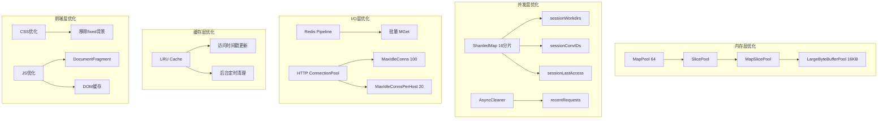

# 设计文档

## 概述

本设计文档描述 AI API 代理服务的全面性能优化实现方案。优化分为三个层次：
1. **内存层优化**：扩展对象池、优化缓存策略
2. **并发层优化**：Map 分片、异步清理
3. **I/O 层优化**：Redis Pipeline、HTTP 连接复用
4. **前端层优化**：CSS 渲染、DOM 操作

预期整体性能提升：
- 内存分配减少 15-20%
- 锁竞争减少 30-40%
- 请求延迟降低 5-10%
- 数据库往返减少 20-30%
- 前端渲染性能提升 30-50%

## 架构



## 组件和接口

### 1. 扩展对象池 (internal/perf/pools.go)

```go
// SlicePool 提供可复用的 []interface{} 切片
var SlicePool = sync.Pool{
    New: func() interface{} {
        s := make([]interface{}, 0, 32)
        return &s
    },
}

// AcquireSlice 从池中获取切片
func AcquireSlice() *[]interface{}

// ReleaseSlice 归还切片到池中
func ReleaseSlice(s *[]interface{})

// MapSlicePool 提供可复用的 []map[string]interface{} 切片
var MapSlicePool = sync.Pool{
    New: func() interface{} {
        s := make([]map[string]interface{}, 0, 16)
        return &s
    },
}

// AcquireMapSlice 从池中获取 map 切片
func AcquireMapSlice() *[]map[string]interface{}

// ReleaseMapSlice 归还 map 切片到池中
func ReleaseMapSlice(s *[]map[string]interface{})

// LargeByteBufferPool 提供 16KB 大缓冲区
var LargeByteBufferPool = sync.Pool{
    New: func() interface{} {
        return bytes.NewBuffer(make([]byte, 0, 16384))
    },
}

// AcquireLargeByteBuffer 获取大缓冲区
func AcquireLargeByteBuffer() *bytes.Buffer

// ReleaseLargeByteBuffer 归还大缓冲区
func ReleaseLargeByteBuffer(b *bytes.Buffer)
```

### 2. 分片 Map (internal/handler/sharded_map.go)

```go
const ShardCount = 16

// ShardedMap 是一个分片的并发安全 Map
type ShardedMap[V any] struct {
    shards [ShardCount]struct {
        mu   sync.RWMutex
        data map[string]V
    }
}

// NewShardedMap 创建新的分片 Map
func NewShardedMap[V any]() *ShardedMap[V]

// getShard 根据 key 获取对应分片索引
func (m *ShardedMap[V]) getShard(key string) int

// Get 获取值
func (m *ShardedMap[V]) Get(key string) (V, bool)

// Set 设置值
func (m *ShardedMap[V]) Set(key string, value V)

// Delete 删除值
func (m *ShardedMap[V]) Delete(key string)

// Range 遍历所有分片
func (m *ShardedMap[V]) Range(fn func(key string, value V) bool)
```

### 3. 异步清理器 (internal/handler/async_cleaner.go)

```go
// AsyncCleaner 管理后台清理任务
type AsyncCleaner struct {
    interval time.Duration
    stopCh   chan struct{}
    wg       sync.WaitGroup
}

// NewAsyncCleaner 创建异步清理器
func NewAsyncCleaner(interval time.Duration) *AsyncCleaner

// Start 启动后台清理
func (c *AsyncCleaner) Start(cleanFn func())

// Stop 停止清理器
func (c *AsyncCleaner) Stop()
```

### 4. Redis Pipeline 优化 (internal/store/redis_store.go)

```go
// 提高并行阈值
const parallelThreshold = 32

// getAccountsByIDsPipelined 使用 Pipeline 批量获取
func (s *redisStore) getAccountsByIDsPipelined(ctx context.Context, ids []int64) ([]*Account, error)
```

### 5. HTTP 连接池配置 (internal/grok/client.go)

```go
// 优化的 HTTP Transport 配置
func newOptimizedHTTPClient(cfg *config.Config, timeout time.Duration, proxyURL *url.URL) *http.Client {
    transport := &http.Transport{
        MaxIdleConns:        100,
        MaxIdleConnsPerHost: 20,
        IdleConnTimeout:     90 * time.Second,
        // ... 其他配置
    }
    return &http.Client{
        Timeout:   timeout,
        Transport: transport,
    }
}

// 预分配的请求头模板
var baseHeaders = http.Header{
    "Accept":          []string{"*/*"},
    "Accept-Language": []string{"zh-CN,zh;q=0.9,en;q=0.8"},
    // ... 其他固定头
}

// headers 返回带 token 的请求头（基于预分配模板）
func (c *Client) headers(token string) http.Header
```

### 6. LRU 缓存优化 (internal/tokencache/memory.go)

```go
// cacheItem 增加访问时间戳
type cacheItem struct {
    tokens     int
    expiresAt  time.Time
    accessedAt time.Time  // 新增：最后访问时间
    size       int64
}

// evictLRULocked 驱逐最近最少使用的条目
func (c *MemoryCache) evictLRULocked()

// startBackgroundCleanup 启动后台清理
func (c *MemoryCache) startBackgroundCleanup(interval time.Duration)
```

### 7. 前端 CSS 优化 (web/static/css/main.css)

```css
/* 优化前 */
body {
  background-attachment: fixed;  /* 移除 */
  background-image:
    radial-gradient(circle at 15% 10%, rgba(124, 92, 252, 0.08) 0%, transparent 40%),
    radial-gradient(circle at 85% 30%, rgba(167, 139, 250, 0.06) 0%, transparent 40%),
    radial-gradient(circle at 50% 80%, rgba(96, 165, 250, 0.04) 0%, transparent 50%);
}

/* 优化后 */
body {
  background-color: var(--bg-body);
  background-image: radial-gradient(ellipse at 50% 0%, rgba(124, 92, 252, 0.06) 0%, transparent 60%);
  /* 单层渐变，无 fixed */
}
```

### 8. 前端 JS 优化 (web/static/js/accounts.js)

```javascript
// DOM 缓存
const domCache = {
    accountsList: null,
    paginationInfo: null,
    paginationControls: null,
};

function initDOMCache() {
    domCache.accountsList = document.getElementById("accountsList");
    domCache.paginationInfo = document.getElementById("paginationInfo");
    domCache.paginationControls = document.getElementById("paginationControls");
}

// 使用 DocumentFragment 批量渲染
function renderAccountsOptimized() {
    const fragment = document.createDocumentFragment();
    // 构建所有行到 fragment
    pageItems.forEach(acc => {
        const tr = createAccountRow(acc);
        fragment.appendChild(tr);
    });
    // 一次性插入
    tbody.appendChild(fragment);
}
```

## 数据模型

### 分片 Map 数据结构

```go
// 分片结构
type shard[V any] struct {
    mu   sync.RWMutex
    data map[string]V
}

// 分片选择使用 FNV-1a 哈希
func fnv1aHash(key string) uint32 {
    h := uint32(2166136261)
    for i := 0; i < len(key); i++ {
        h ^= uint32(key[i])
        h *= 16777619
    }
    return h
}
```

### LRU 缓存条目

```go
type cacheItem struct {
    tokens     int       // token 计数
    expiresAt  time.Time // 过期时间
    accessedAt time.Time // 最后访问时间（LRU 用）
    size       int64     // 条目大小
}
```

## 正确性属性

*正确性属性是在系统所有有效执行中都应保持为真的特征或行为——本质上是关于系统应该做什么的形式化陈述。属性作为人类可读规范和机器可验证正确性保证之间的桥梁。*


### Property 1: 对象池获取归还一致性

*对于任意* 对象池（SlicePool、MapSlicePool、LargeByteBufferPool），获取对象后归还，再次获取应得到已重置的干净对象。

**验证: 需求 1.2, 1.3, 1.5**

### Property 2: 分片 Map 键映射一致性

*对于任意* 字符串 key，多次调用 getShard(key) 应始终返回相同的分片索引。

**验证: 需求 2.4**

### Property 3: 分片 Map 并发安全性

*对于任意* 一组并发的 Get/Set/Delete 操作，分片 Map 应保持数据一致性且不产生死锁。

**验证: 需求 2.5**

### Property 4: LRU 驱逐正确性

*对于任意* 缓存状态，当缓存满时插入新条目，被驱逐的应是访问时间最早的条目。

**验证: 需求 6.1, 6.2**

### Property 5: 异步清理器生命周期

*对于任意* AsyncCleaner 实例，Start 后应定期执行清理，Stop 后应停止执行且 goroutine 退出。

**验证: 需求 3.1, 3.4**

## 错误处理

### 对象池错误处理

- 归还 nil 对象：静默忽略，不 panic
- 归还过大对象：丢弃不放回池中，防止内存膨胀
- 类型断言失败：使用 New 函数创建新对象

### 分片 Map 错误处理

- 空 key：正常处理，映射到固定分片
- 并发修改：通过分片锁保证安全

### Redis Pipeline 错误处理

- Pipeline 执行失败：回退到单命令模式
- 部分命令失败：记录错误，返回成功的结果
- 连接断开：依赖 go-redis 自动重连

### HTTP 连接池错误处理

- 连接超时：返回错误，由上层重试
- 连接池耗尽：等待或创建新连接

### LRU 缓存错误处理

- 后台清理 panic：recover 并记录日志，不影响主流程
- 并发访问：通过 RWMutex 保证安全

## 测试策略

### 单元测试

1. **对象池测试**
   - 测试各池的 Acquire/Release 功能
   - 验证对象重置正确性
   - 验证大对象不回池

2. **分片 Map 测试**
   - 测试 Get/Set/Delete 基本功能
   - 测试 Range 遍历
   - 验证分片数量

3. **异步清理器测试**
   - 测试 Start/Stop 生命周期
   - 验证清理函数被调用

4. **LRU 缓存测试**
   - 测试 LRU 驱逐顺序
   - 测试访问时间更新

### 属性测试

使用 Go 的 `testing/quick` 或 `gopter` 库进行属性测试：

1. **Property 1 测试**: 对象池获取归还一致性
   - 生成随机操作序列
   - 验证归还后对象状态

2. **Property 2 测试**: 分片键映射一致性
   - 生成随机字符串
   - 验证多次映射结果相同

3. **Property 3 测试**: 分片 Map 并发安全性
   - 并发执行随机操作
   - 验证无死锁、数据一致

4. **Property 4 测试**: LRU 驱逐正确性
   - 生成随机访问模式
   - 验证驱逐的是最久未访问的

5. **Property 5 测试**: 异步清理器生命周期
   - 测试 Start/Stop 序列
   - 验证清理执行和停止

### 性能基准测试

```go
func BenchmarkMapPoolAcquireRelease(b *testing.B)
func BenchmarkShardedMapConcurrent(b *testing.B)
func BenchmarkLRUCacheAccess(b *testing.B)
```

### 前端测试

- 使用浏览器开发者工具的 Performance 面板验证滚动帧率
- 使用 Lighthouse 评估渲染性能
